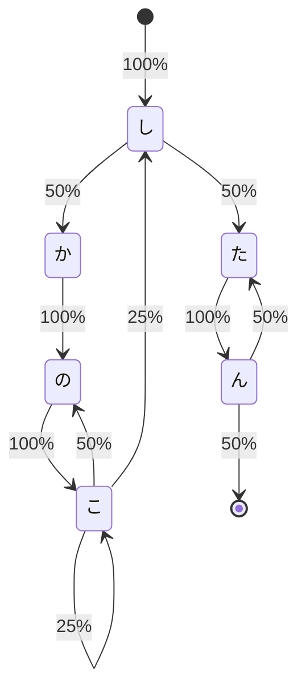

# しかのこのこのここしたんたん

## モデル化

本稿では、"しかのこのこのここしたんたん"という文字列の生成を有限状態単純マルコフ連鎖によってモデル化している。

状態空間で離散的であるため、このモデルは状態遷移確率行列によって表現することができる。

`(s)` は開始状態、`(e)` は終了状態である。前者は文章の先頭、後者は文章の末尾を表す。

### 状態遷移図



### 状態遷移確率行列

|     | (s) | し  | か  | の  | こ  | た  | ん  | (e) |
| --- | --- | --- | --- | --- | --- | --- | --- | --- |
| (s) | 0   | 100 | 0   | 0   | 0   | 0   | 0   | 0   |
| し  | 0   | 0   | 50  | 0   | 0   | 0   | 50  | 0   |
| か  | 0   | 0   | 0   | 100 | 0   | 0   | 0   | 0   |
| の  | 0   | 0   | 0   | 0   | 100 | 0   | 0   | 0   |
| こ  | 0   | 25  | 0   | 50  | 25  | 0   | 0   | 0   |
| た  | 0   | 0   | 0   | 0   | 0   | 0   | 100 | 0   |
| ん  | 0   | 0   | 0   | 0   | 0   | 50  | 0   | 50  |
| (e) | -   | -   | -   | -   | -   | -   | -   | -   |

## 実行結果
```bash
$ for ((i=0; i<20;i++)) cargo run --release 2> /dev/null
しかのこここしかのこここのこのこしたん
しかのこのここしたん
したんたん
したんたんたんたんたんたんたんたんたん
したん
しかのここのこのこのこしたんたん
したんたん
しかのこのここしたん
したんたん
しかのこのこのここのここのこしかのこしたん
しかのこのこここのこしたん
しかのこのこのこのこしかのこしたん
しかのここのこのこのここのこしかのこしかのこのこしかのこここしかのこしかのこしかのこしたん
しかのこのこのこのこのこのこのこのこのこのこしたんたんたん
しかのこここのこしたん
しかのここのここのこのこしかのこしかのこのこしかのこのこのここしかのここのこのこのこのここのここしたん
しかのこしたんたん
しかのこのこのここのこしかのこここしかのこのこしかのここのこしたん
しかのこしかのこのこのここのこここのこのこしかのこのこここのこのここのここしたん
しかのこのこのこのこのこしかのこしたんたんたん
```